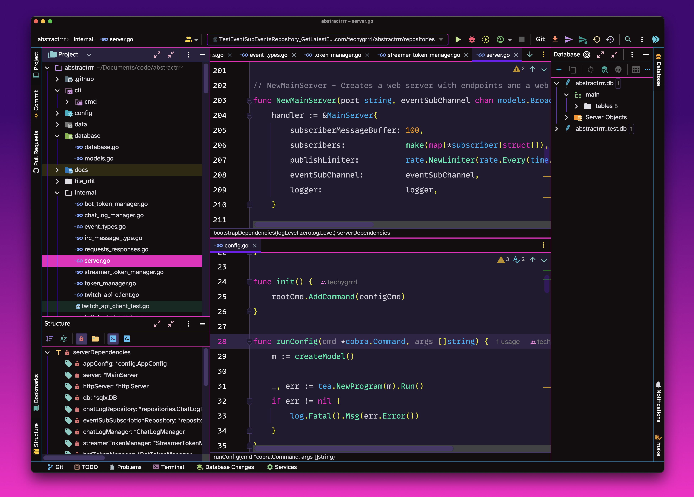

<h1 align="center">CMYK colourrrs</h1>

  

  <strong>CMYK colourrrs UI theme</strong> is a UI theme for Jetbrains IDE's.

  by <a href="https://techygrrrl.stream">techygrrrl</a>

---

## UI Theme

This repository contains the UI theme only. It does not include the colour scheme.

To get the colour scheme, go to the [CMYK colourrrs](https://github.com/techygrrrl/techygrrrl-cmyk-colourrrs-jetbrains) colour scheme repository.

## Usage

Download the JAR from the releases.

## Screenshots

Here is a screenshot of the UI theme (and the colour scheme linked above) in GoLand.

<small>Icons in screenshot from [Atom Material Icons](https://plugins.jetbrains.com/plugin/10044-atom-material-icons)</small>

## Changelog

| Version | Date         | Details                |
|---------|--------------|------------------------|
| 1.1.0   | Dec 28, 2023 | Support moar builds    |
| 1.0.0   | May 25, 2023 | 🌈 Initial release! 🦄 |
