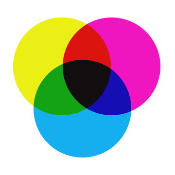

<h1 align="center">CMYK colourrrs</h1>

  

  <strong>CMYK colourrrs</strong> is a dark theme for JetBrains IDE's.

  by <a href="https://techygrrrl.stream">techygrrrl</a>

---

See more screenshots, and installation and usage instructions in the [wiki](https://github.com/techygrrrl/techygrrrl-cmyk-jetbrains-theme/wiki).

## Changelog

| Version | Date         | Details                                     |
| ------- | ------------ | ------------------------------------------- |
| 1.2.1   | Feb 10, 2024 | Fix colours for TypeScript (React, regex)   |
| 1.2.0   | Feb 9, 2024  | Bundle the colour scheme with the UI theme. |
| 1.1.0   | Dec 28, 2023 | Support moar builds                         |
| 1.0.0   | May 25, 2023 | 🌈 Initial release! 🦄                      |
